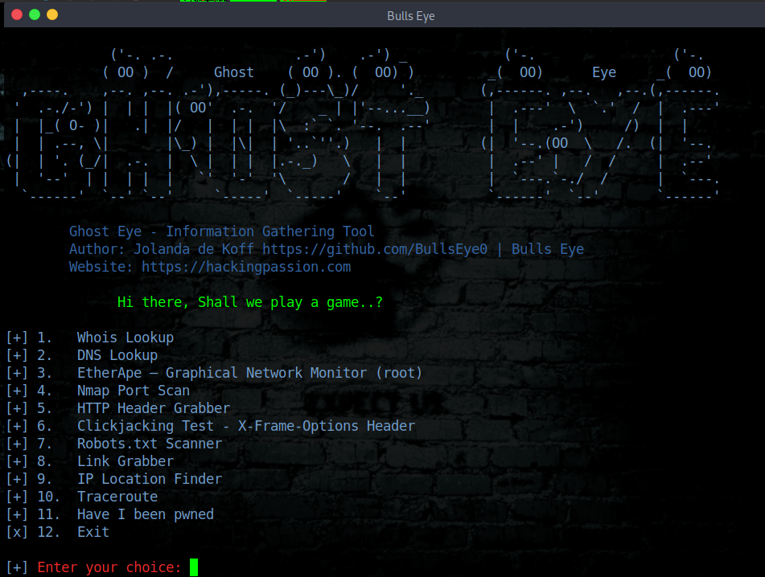

# Ghost Eye
Ghost Eye - Information Gathering Tool

Ghost Eye is an Information Gathering Tool I made in python 3. 
To run Ghost Eye, it only needs a domain or ip.
Ghost Eye can work with any Linux distros if they support Python 3.

****
Here you can read an article i wrote about Ghost Eye

https://hackingpassion.com/getting-started-with-ghost-eye/

****

## Ghost Eye gathers information data such as:

1.   Whois Lookup
2.   DNS Lookup
3.   EtherApe
4.   Nmap Port Scan
5.   HTTP Header Grabber
6.   Clickjacking Test
7.   Robots.txt Scanner
8.   Link Grabber
9.   IP Location Finder
10.  Traceroute
11.  Have I been pwned
12.  Exit

  
**Video demo: Watch on Youtube:
https://youtu.be/XCtWM-4ov2U

## Install and run on Linux
You have to install Python 3 first:

  
* Install Python 3 on Arch Linux and its distros: sudo pacman -S python3
* Install Python 3 on Debian and its distros: sudo apt install python3

 
 
You have to install Nmap and EtherApe too:

  
* On Arch Linux and its distros: sudo pacman -S nmap etherape

  
* On Debian and its distros: sudo apt install nmap etherape

After installing Etherape sometimes a GNOME error can occur, for which you install: (This will solve the common error)
* apt install libgnomeui-0: amd64

    
    
## Install Ghost Eye:
* git clone https://github.com/BullsEye0/ghost_eye.git

* cd ghost_eye
  
* pip3 install -r requirements.txt

  
## Use:
* python3 ghost_eye.py

# Contact to coder
Social Networks - Connect

* Website [HackingPassion.com](https://hackingpassion.com)

* [Facebook Personal](https://www.facebook.com/jolandadekoff)

* [linkedin](https://www.linkedin.com/in/jolandadekoff/)

* [Youtube](https://youtu.be/XCtWM-4ov2U)

* [Facebook Page](https://www.facebook.com/ethical.hack.group)

* [Facebook Group](https://www.facebook.com/groups/ethical.hack.group/)
  
  

***

## Donate

I have developed Ghost Eye because I am passionate about this. 
Donations are one of the many ways to support what I do.

[Donate](https://bullseye0.com/donate)

BAT: Use [Brave](https://brave.com/bul891) and donate on any of my web pages/profiles

