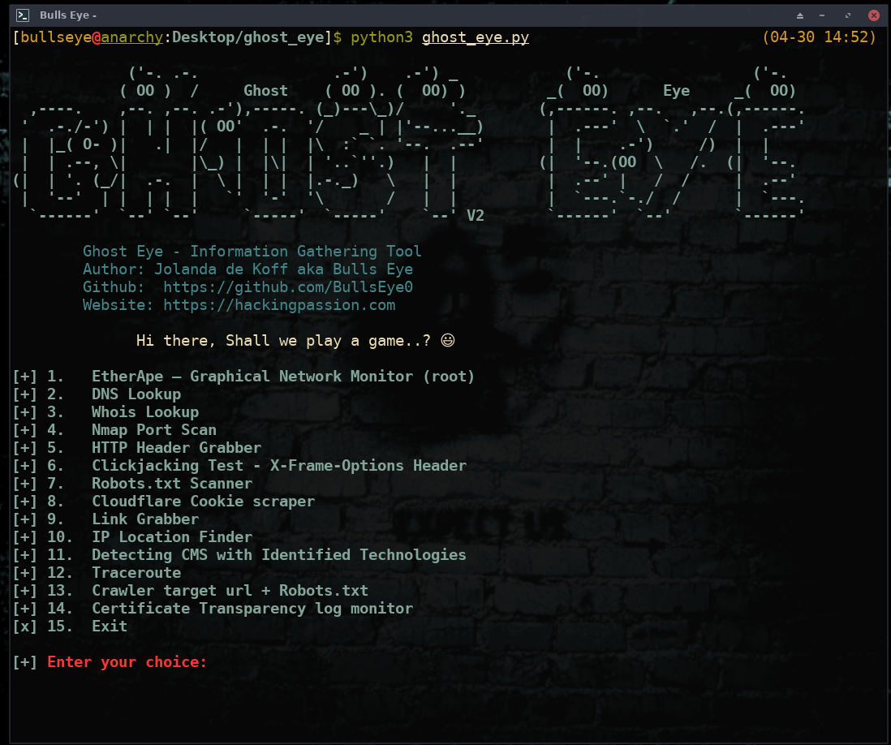

# Ghost Eye
Ghost Eye - Information Gathering Tool
<div>

**Ghost Eye** New Release. Ghost Eye is an Information Gathering, Footprinting, Scanner, and Recon Tool I made in Python 3. Since the last release of Ghost Eye, I've tweaked, removed, and added some new features. So that Ghost Eye would become more of a whole. For me, it remains a game of options so that together you get a complete overview of your target.

****
Here you can read an article i wrote about Ghost Eye

https://hackingpassion.com/ghost-eye-informationgathering-footprinting-and-reconnaissance-tool-release/

****


## Ghost Eye gathers information data such as:

Hi there, Shall we play a game..? 😃

[+] 1.   EtherApe – Graphical Network Monitor (root)

[+] 2.   DNS Lookup

[+] 3.   Whois Lookup

[+] 4.   Nmap Port Scan

[+] 5.   HTTP Header Grabber

[+] 6.   Clickjacking Test - X-Frame-Options Header

[+] 7.   Robots.txt Scanner

[+] 8.   Cloudflare Cookie scraper

[+] 9.   Link Grabber

[+] 10.  IP Location Finder

[+] 11.  Detecting CMS with Identified Technologies

[+] 12.  Traceroute

[+] 13.  Crawler target url + Robots.txt

[+] 14.  Certificate Transparency log monitor

[x] 15.  Exit

[+] Enter your choice:



  
## Video demo: Watch on LBRY/Odysee

**[Video](https://open.lbry.com/@hackingpassion:9/Ghost-Eye-Informationgathering-Footprinting-Scanner-and-Recon-Tool-Release:3)**


## Install and run on Linux
 
You have to install Nmap and EtherApe too:

  
* On Arch Linux and its distros: 
```
sudo pacman -S etherape nmap dnsutils gnome-terminal httpie mtr
```

  
* On Debian and its distros (Kali Linux, Parrot Security OS): 
```
sudo apt install etherape nmap dnsutils gnome-terminal httpie mtr
```

After installing Etherape sometimes a GNOME error can occur, for which you install: (This will solve the common error)
* apt install libgnomeui-0: amd64

    
    
## Install Ghost Eye:
* git clone https://github.com/BullsEye0/ghost_eye.git

* cd ghost_eye
  
* pip3 install -r requirements.txt

  
## Use:
* python3 ghost_eye.py


# Contact to coder
Social Networks - Connect

* Website [HackingPassion.com](https://hackingpassion.com)

* [Facebook Personal](https://www.facebook.com/jolandadekoff)

* [linkedin](https://www.linkedin.com/in/jolandadekoff/)

* [LBRY/Odysee](https://lbry.tv/$/invite/@hackingpassion:9)

* [Facebook Page](https://www.facebook.com/ethical.hack.group)

* [Facebook Group](https://www.facebook.com/groups/ethical.hack.group/)
  
  

***

## Donate


I have developed Ghost Eye because I am passionate about this. 
Donations are one of the many ways to support what I do.

[Donate](https://bullseye0.com/donate)

BAT: Use [Brave](https://brave.com/bul891) and donate on any of my web pages/profiles

[](https://www.paypal.com/cgi-bin/webscr?cmd=_s-xclick&hosted_button_id=R96YN2PUS8V8W)

