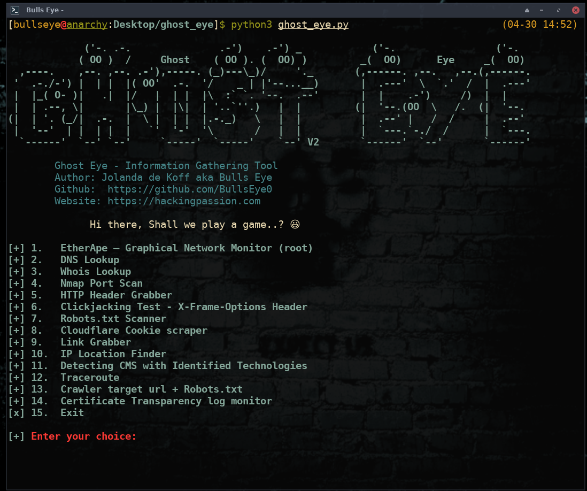

# Ghost Eye
Ghost Eye - Information Gathering Tool

> ⚠️ **Legal & Ethical Use**: Ghost Eye is intended for authorized security testing, bug bounty programs, and educational purposes only. Only scan domains, IPs, or systems you own or have explicit written permission to test. Unauthorized scanning may violate computer misuse laws in your jurisdiction.

**Ghost Eye** New Release. Ghost Eye is an Information Gathering, Footprinting, Scanner, and Recon Tool I made in Python 3. Since the last release of Ghost Eye, I've tweaked, removed, and added some new features. So that Ghost Eye would become more of a whole. For me, it remains a game of options so that together you get a complete overview of your target.
****
Here you can read an article i wrote about Ghost Eye
https://hackingpassion.com/ghost-eye-informationgathering-footprinting-and-reconnaissance-tool-release/
****
## Ghost Eye gathers information data such as:
Hi there, Shall we play a game..? 😃
[+] 1.   EtherApe – Graphical Network Monitor (root)

[+] 2.   DNS Lookup

[+] 3.   Whois Lookup

[+] 4.   Nmap Port Scan

[+] 5.   HTTP Header Grabber

[+] 6.   Clickjacking Test - X-Frame-Options Header

[+] 7.   Robots.txt Scanner

[+] 8.   Cloudflare Cookie scraper

[+] 9.   Link Grabber

[+] 10.  IP Location Finder

[+] 11.  Detecting CMS with Identified Technologies

[+] 12.  Traceroute

[+] 13.  Crawler target url + Robots.txt

[+] 14.  Certificate Transparency log monitor

[+] 15.  DNS Records Lookup (A/AAAA/MX/NS/TXT/SOA/CNAME)

[+] 16.  Subdomain Enumeration (Certificate Transparency based)

[+] 17.  SSL/TLS Certificate Info

[+] 18.  Security Headers Analyzer

[+] 19.  WAF / CDN Detection

[+] 20.  Port Banner Grabber

[+] 21.  Email Harvester

[x] 22.  Exit

[+] Enter your choice:



## 🆕 What's new in this fork/update

This version adds seven new reconnaissance modules on top of the original tool, plus automatic result logging:

* **DNS Records Lookup** – pulls A, AAAA, MX, NS, TXT, SOA, and CNAME records for a domain in one go.
* **Subdomain Enumeration** – passively discovers subdomains by querying Certificate Transparency logs (crt.sh), no brute force or noisy traffic involved.
* **SSL/TLS Certificate Info** – shows issuer, subject, validity dates, serial number, and Subject Alternative Names for a target's certificate.
* **Security Headers Analyzer** – checks for the presence of key hardening headers (HSTS, CSP, X-Content-Type-Options, X-Frame-Options, Referrer-Policy, Permissions-Policy) and explains what each one protects against.
* **WAF / CDN Detection** – fingerprints common WAF/CDN providers (Cloudflare, Akamai, Sucuri, Imperva/Incapsula, AWS CloudFront, Fastly, F5 BIG-IP ASM, ModSecurity) from response headers and cookies.
* **Port Banner Grabber** – opens a TCP connection to a chosen host/port and grabs the service banner.
* **Email Harvester** – extracts publicly listed email addresses found on a target page.
* **Automatic logging** – results from the new modules are saved as timestamped files under `logs/` so you can review or diff scans later.

All new modules are passive/read-only information-gathering techniques, consistent with the rest of Ghost Eye — intended for authorized security assessments, bug bounty recon, and educational use only.

## Video demo: Watch on LBRY/Odysee
**[Video](https://open.lbry.com/@hackingpassion:9/Ghost-Eye-Informationgathering-Footprinting-Scanner-and-Recon-Tool-Release:3)**

****

## Install and run on Linux
 
You have to install Nmap and EtherApe too:
  
* On Arch Linux and its distros: 
```bash
sudo pacman -S etherape nmap dnsutils gnome-terminal httpie mtr
```
  
* On Debian and its distros (Kali Linux, Parrot Security OS): 
```bash
sudo apt install etherape nmap dnsutils gnome-terminal httpie mtr
```
After installing Etherape sometimes a GNOME error can occur, for which you install: (This will solve the common error)
```bash
apt install libgnomeui-0:amd64
```
****
    
## Installation Steps:

1. **Clone the repository:**
```bash
git clone https://github.com/BullsEye0/ghost_eye.git
cd ghost_eye
```

2. **Create a virtual environment (recommended):**
```bash
python3 -m venv venv
source venv/bin/activate  # On Windows: venv\Scripts\activate
```

3. **Install dependencies:**
```bash
pip3 install -r requirements.txt
```

****

## How to use Ghost Eye
```bash
python3 ghost_eye.py
```

Have fun ..! 😃

****

# Contact to coder
Social Networks - Connect

* Website [HackingPassion.com](https://hackingpassion.com)

* [Facebook Personal](https://www.facebook.com/profile.php?id=100069546190609)

* [linkedin](https://www.linkedin.com/in/jolandadekoff/)

* [LBRY/Odysee](https://lbry.tv/$/invite/@hackingpassion:9)

* [Youtube](https://www.youtube.com/@HackingPassion)

* [Facebook Page](https://www.facebook.com/ethical.hack.group)

* [Facebook Group](https://www.facebook.com/groups/ethical.hack.group/)


***

## 💻 Support this project

If you find this tool useful, consider supporting my work:  
[❤️ Sponsor BullsEye](https://github.com/sponsors/BullsEye0)

Get the full hands-on course:  
**[Ethical Hacking Complete Course – Zero to Expert](https://www.udemy.com/course/ethical-hacking-complete-course-zero-to-expert/?couponCode=AUGUST2026)**

(supports me directly as your instructor!)

Professional penetration testing. Zero to Expert.  
✅ Kali Linux + Parrot OS  
✅ Real-world hacking scenarios  
✅ All major tools & techniques  
✅ Beginner-friendly  

HACKING IS NOT A HOBBY, BUT A WAY OF LIFE 🎯

***

## Donate

I have developed Ghost Eye because I am passionate about this. 
Donations are one of the many ways to support what I do.

[Donate](https://hackingpassion.com/donate/)

BAT: Use [Brave](https://brave.com/bul891) and donate on any of my web pages/profiles

[](https://www.paypal.com/cgi-bin/webscr?cmd=_s-xclick&hosted_button_id=R96YN2PUS8V8W)
